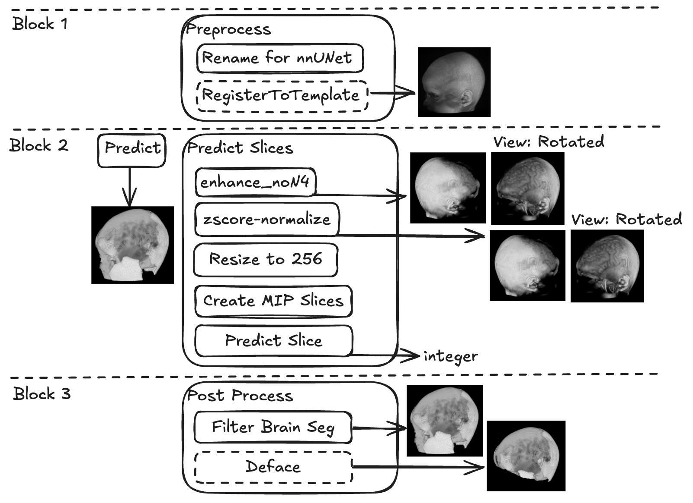

# Setup
You can use this pip example or conda if you want. Just make sure to install `python3.11` and all necessary dependancies.
```
python3.11 -m venv venv
source venv/bin/activate
pip install --upgrade pip
pip install -r requirements.txt
pip install --upgrade git+https://github.com/FabianIsensee/hiddenlayer.git
```

## Download Weights
Run
```
python download_weights.py
```

You can also find weights for TissUNet by [this link](https://drive.google.com/drive/folders/18c06FU825eIsgyscO1CEbZf8jszzKJdT?usp=drive_link)

## Project Structure
Below is the sample of initial project structure.
```
TissUNet \ <cloned repo>
    venv \
    mr \
        meta.csv
        sample_name_1.nii.gz (or .nii)
        sample_name_2.nii.gz (or .nii)
        ...
        sample_name_n.nii.gz (or .nii)
    nnUNet_results \
        Dataset003_synthrad \
            nnUNetTrainer__nnUNetPlans__3d_fullres \
    model_weights \ <weights for densenet>
    .gitignore
    README.md
    preprocess.py
    postprocess.py
    compute_metrics.py
    requirements.in
    requirements.txt
```

The `meta.csv` should contain columns `filename`, `age` and `sex` and entry for each MR file. Here is an example of `meta.csv`
```
filename,age,sex
BCP-418009-53mo-v1_8_T1w.nii,6,F
BCP-431010-64mo-v1_13_T1w.nii,9,M
IXI621-Guys-1100-T1.nii,12,F
```

## Pipeline Visualization


# Step 1: Preprocess
The following script will reorient all `.nii.gz` in `<in_dir>` into LPI orientation and add `_0000.nii.gz` postfix. If `<out_dir>` is not specified, it will overwrite files in `<in_dir>`. Pass the `--no-register` flag if you want to omit the registration phase.
```
python preprocess.py -i <in_dir> [-o <out_dir>] [--no-register]
```
Example:
```
python preprocess.py -i mr -o mr_pre
```

# Step 2: Predict
## Predict TissUNet
This will run TissUNet on all `.nii.gz` files in `<in_dir>` and write results in `<out_dir>`. During the script execution, the temporary files in LPI orientation are created inside `<in_dir>`. Specify the `--cleanup` flag to automatically remove them after script completion.
```
export nnUNet_raw="$(pwd)/<any_path_really_this_stuff_is_required_even_though_not_used>"
export nnUNet_preprocessed="$(pwd)/<any_path_really_this_stuff_is_not_used_but_suppresses_the_warning>"
export nnUNet_results="$(pwd)/<relative_path_to_nnUNet_results>"
python predict.py -i <in_dir> \
                  -o <out_dir> \
                  -d <cpu/cuda> \
                 [--cleanup]
```
Example:
```
export nnUNet_raw="$(pwd)/nnUNet_raw" # This path does not exist lol
export nnUNet_preprocessed="$(pwd)/nnUNet_preprocessed"
export nnUNet_results="$(pwd)/nnUNet_results"
python predict.py -i mr_pre \
                  -o preds \
                  -d cuda \
                  --cleanup
```

## Predict Slices
This will run DenseNet slice prediction on all `.nii.gz` files in `<in_dir>` using `<in_meta_path>` write those values in `slice_label` column and save it in the `<out_meta_path>`.
```
python predict_slices.py -i <in_dir> \
                         -mi <in_meta_path> \
                         -mo <out_meta_path>
                         [--model_weight_path_selection <custom path to model weights>]
                         [--cuda_visible_devices <custom device incices. defaults to 0>]
```
Example:
```
python predict_slices.py -i mr_pre \
                         -mi mr_pre/meta.csv \
                         -mo preds/meta.csv
```

# Step 3: Post-process
The following script will filter brain mask (retain only the largest connected componnent) and deface if `--deface` flag is specified.
```
python postprocess.py -mi <mr_input_path> \
                      -pi <preds_input_path> \
                      -mo <mr_output_path> \
                      -po <preds_output_path> \
                      --deface
```
Example:
```
python postprocess.py -mi mr_pre \
                      -pi preds \
                      -mo mr_post \
                      -po preds_post

python postprocess.py -mi mr_pre \
                      -pi preds \
                      -mo mr_post_def \
                      -po preds_post_def \
                      --deface
```

# Step 4: Compute metrics
To compute metrics for a single directory of predictions use:
```
python compute_metrics.py -pi <preds_input_path> \
                          -mo <metrics_json_output_file_path>
```
Example:
```
python compute_metrics.py -pi preds_post \
                          -mo preds_post/metrics.csv

python compute_metrics.py -pi preds_post_def \
                          -mo preds_post_def/metrics.csv
```

# Optional: Skull Thickness Estimation
To batch process multiple datasets for the skull thickness estimation, please add the foldernames of the datasets you'd like to process under `datasets`. Our folder setup is as follows:

```
data/
├── 3d_outputs/
│   └── ExampleDataset/
│       ├── file1.nii.gz
│       ├── file2.nii.gz
│       └── file3.nii.gz
├── supp_data/
│   └── metadata_ExampleDataset.csv
results/
├── plots/
│   └── ExampleDataset/
└── results_thickness/
    └── ExampleDataset/
```

```
bash process_thickness_estimation.sh \
-- lookup-slice-table "supp_data/metadata_$dataset.csv" \
-- csv-output-dir "results/results_thickness/$dataset" \
-- plot-output-dir "results/results_thickness/$dataset" \
-- processed-image-dir "data/3d_outputs/$dataset" \

```

# Known Issues
- For some slices IMEA throws a warning during 2D (micro) metrics computation: `Slope is zero slope --> fractal dimension will be set to zero`.
- For some slices the volumetrics computed by IMEA and by hand differ by a few pixels.