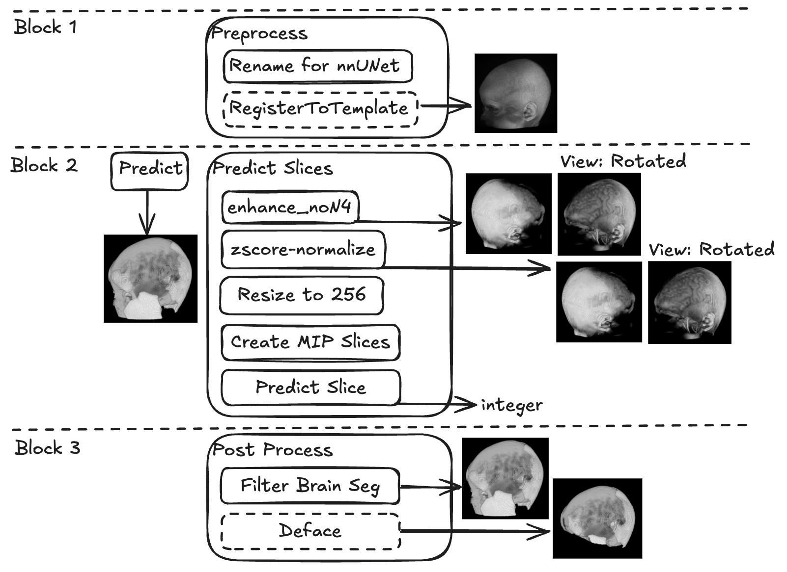
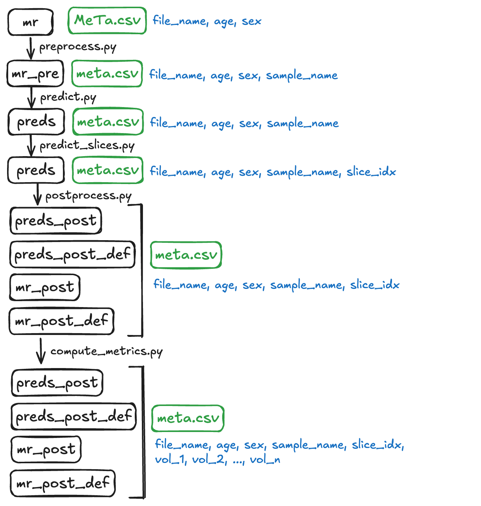

# TissUnet: Improved Extracranial Tissue and Cranium Segmentation for Children through Adulthood
Code for the preprint [Arxiv](https://arxiv.org/abs/2506.05660)

Please cite:
```
@misc{mandzak2025tissunetimprovedextracranialtissue,
  title        = {TissUnet: Improved Extracranial Tissue and Cranium Segmentation for Children through Adulthood},
  author       = {Markiian Mandzak and Elvira Yang and Anna Zapaishchykova and Yu-Hui Chen and Lucas Heilbroner and John Zielke and Divyanshu Tak and Reza Mojahed-Yazdi and Francesca Romana Mussa and Zezhong Ye and Sridhar Vajapeyam and Viviana Benitez and Ralph Salloum and Susan N. Chi and Houman Sotoudeh and Jakob Seidlitz and Sabine Mueller and Hugo J. W. L. Aerts and Tina Y. Poussaint and Benjamin H. Kann},
  year         = {2025},
  eprint       = {2506.05660},
  archivePrefix= {arXiv},
  primaryClass = {cs.CV},
  url          = {https://arxiv.org/abs/2506.05660},
}
```

# Setup
Use pip to setup the project.
```
python3.11 -m venv venv
source venv/bin/activate
pip install --upgrade pip
pip install -r requirements.txt
pip install --upgrade git+https://github.com/FabianIsensee/hiddenlayer.git
```

## Download Weights
Run
```
python download_weights.py
```

You can also find weights for TissUNet at [this link](https://www.dropbox.com/scl/fo/nu00kaibm1dy74lt34ecx/AGX4pLbs5RO1P9dHQgjz13I?rlkey=8wz0y0wfij16q1onwipw19qhx&st=hxpz1b6j&dl=0)

## Project Structure
Below is a sample of project structure.
```
TissUNet \ <cloned repo>
    venv \
    assets \
    golden_image \
    mr \
        meta.csv
        sample_name_1.nii.gz (or .nii)
        sample_name_2.nii.gz (or .nii)
        ...
        sample_name_n.nii.gz (or .nii)
    nnUNet_results \
        Dataset003_synthrad \
            nnUNetTrainer__nnUNetPlans__3d_fullres \
    model_weights \ <weights for densenet>
    .gitignore
    README.md
    preprocess.py
    predict.py
    predict_slices.py
    postprocess.py
    compute_metrics.py
    requirements.in
    requirements.txt
    run_pipeline.sh
```

The `meta.csv` should contain columns `file_name`, `age`(in years, can be a float number), `sex` and row for each MR file:
```
file_name,age,sex,[slice_idx]
sample_name_1.nii.gz,sample_age_years_1,sample_sex_1,slice_idx_1
sample_name_2.nii.gz,sample_age_years_2,sample_sex_2,slice_idx_2
...
sample_name_n.nii.gz,sample_age_years_3,sample_sex_3,slice_idx_3
```

Here is an example of `meta.csv`
```
file_name,age,sex
BCP-418009-53mo-v1_8_T1w.nii,6,F
BCP-431010-64mo-v1_13_T1w.nii,9,M
IXI621-Guys-1100-T1.nii,12,F
```

<!-- ## Visualizations
### Operations


### Dir/Meta

where:
- BLACK. color denotes `DIRECTORY`
- <span style="color:green">GREEN</span> color denotes `META`
- <span style="color:blue">BLUE</span> color denotes `COLUMNS IN META` -->
# Option 1: Using a bash script to run the pipeline
For convenience, you can run the entire pipeline using the provided bash script. This will execute all steps in order, from preprocessing to computing metrics. 

<!-- The pipeline predicts axial slice indices (see details) and writes them to the `slice_idx` column in a copy of meta.csv. To skip the slice prediction, use `--no-predict-slices` and provide the `slice_idx` column. 

To skip image registration during preprocessing, use `--no-register`.

Predicted MR images in LPI orientation are saved in the temp folder. Use `--cleanup` to delete this folder after predictions and save space.

To specify a custom `meta` file path (defaut `<in_dir>/meta.csv`) use `--meta`. -->
```
bash run_pipeline.sh <in_dir> <out_dir> <cpu/cuda> [--no-register] [--cleanup] [--no-predict-slices] [--meta]
```
Parameters:
- `<in_dir>`: Input directory (e.g., mr)
- `<out_dir>`: Output directory (e.g., out)
- `<cpu/cuda>`: Specify whether to use CPU or CUDA
- `--no-register`: Skip image registration
- `--cleanup`: Delete temp folder after predictions
- `--no-predict-slices`: Skip slice prediction (requires slice_idx in meta.csv)
- `--meta`: Path to a custom meta.csv file (default is <in_dir>/meta.csv)

Example:
```
bash run_pipeline.sh mr out cuda --no-predict-slices --meta mr/custom_meta.csv
```
with `mr/custom_meta.csv`:
```
file_name,age,sex,slice_idx
BCP-418009-53mo-v1_8_T1w.nii,6,F,32
BCP-431010-64mo-v1_13_T1w.nii,9,M,43
IXI621-Guys-1100-T1.nii,12,F,51
```

# Option 2: Using individual scripts to run the pipeline
## Step 1: Preprocess
The following script will reorient all `.nii.gz` in `<in_dir>` into LPI orientation and add `_0000.nii.gz` postfix. If `<out_dir>` is not specified, it will overwrite files in `<in_dir>`. Pass the `--no-register` flag if you want to omit the registration phase.
```
python preprocess.py -i <in_dir> -o <out_dir> [--no-register]
```
Example:
```
python preprocess.py -i mr -o mr_pre
```

## Step 2: Predict
### Predict TissUNet
This will run TissUNet on all `.nii.gz` files in `<in_dir>` and write results in `<out_dir>`. During script execution, the temporary files in LPI orientation are created inside `<in_dir>`. Specify the `--cleanup` flag to automatically remove them after script completion.
```
export nnUNet_raw="$(pwd)/<any_path_really_this_stuff_is_required_even_though_not_used>"
export nnUNet_preprocessed="$(pwd)/<any_path_really_this_stuff_is_not_used_but_suppresses_the_warning>"
export nnUNet_results="$(pwd)/<relative_path_to_nnUNet_results>"
python predict.py -i <in_dir> \
                  -o <out_dir> \
                  -d <cpu/cuda> \
                 [--cleanup]
```
Example:
```
export nnUNet_raw="$(pwd)/nnUNet_raw" # This path does not exist lol
export nnUNet_preprocessed="$(pwd)/nnUNet_preprocessed"
export nnUNet_results="$(pwd)/nnUNet_results"
python predict.py -i mr_pre \
                  -o preds \
                  -d cuda \
                  --cleanup
```


### Optional: Predict Slices (needed only for the skull thickness estimation)
This will run DenseNet slice prediction on all `.nii.gz` files in `<in_dir>` using `<in_meta_path>` write those values in the `slice_label` column, and save it in the `<out_meta_path>`.
```
python predict_slices.py -i <in_dir> \
                         -mi <in_meta_path> \
                         -mo <out_meta_path>
                         [--model_weight_path_selection <custom path to model weights>]
                         [--cuda_visible_devices <custom device incices. defaults to 0>]
```
Example:
```
python predict_slices.py -i mr_pre \
                         -mi mr_pre/meta.csv \
                         -mo preds/meta.csv
```

## Step 3: Post-process
The following script will filter brain masks (retain only the largest connected componnent) and deface if the `--deface` flag is specified.
```
python postprocess.py -mi <mr_input_path> \
                      -pi <preds_input_path> \
                      -mo <mr_output_path> \
                      -po <preds_output_path> \
                      --deface
```
Example:
```
python postprocess.py -mi mr_pre \
                      -pi preds \
                      -mo mr_post \
                      -po preds_post

python postprocess.py -mi mr_pre \
                      -pi preds \
                      -mo mr_post_def \
                      -po preds_post_def \
                      --deface
```

## Step 4: Compute metrics
To compute metrics for a single directory of predictions, use:
```
python compute_metrics.py -pi <preds_input_path> \
                          -mo <metrics_json_output_file_path>
```
Example:
```
python compute_metrics.py -pi preds_post \
                          -mo preds_post/metrics.csv

python compute_metrics.py -pi preds_post_def \
                          -mo preds_post_def/metrics.csv
```
The output CSV contains one row per NIfTI file, with columns for the file name, file path, sample name, and voxel volumes for each labeled tissue (e.g., vol_brain, vol_skull, vol_temporalis, etc.).


# Optional: Skull Thickness Estimation
To estimate skull thickness on a single dataset, run the following script:
```
python scripts/main_thickness_estimation.py --dataset "YOUR_DATASET_NAME" \
--lookup-slice-table preds/meta.csv \
--csv-output-dir path/to/results_thickness \
--plot-output-dir path/to/results_thickness \
--processed-image-dir mr_pre
```

Where:
- `YOUR_DATASET_NAME` is your custom dataset name (can be anything),
- `preds/meta.csv` is a path from -mo option from the "Predict Slices" step,
- `path/to/results_thickness` is a path where the output will be stored (useful for debug),
- `processed-image-dir` is a path to predicted masks from "Predict" step

The aggregated and filtered skull thickness results will be stored in `path/to/results_thickness/global_thickness_calculation.csv`. There will also be `path/to/results_thickness/skipped_images.csv` with info on failed cases.

For the batched processing (aka multiple dataset setup, [see here](https://github.com/AIM-KannLab/TissUNet/blob/main/scripts/Readme_batched_skulls.md)

# Known Issues
- Not tested for gestational 36-44 weeks (neonatal) MRIs. The pipeline may not work for neonatal MRIs due to differences in brain structure and segmentation.

## License
CC BY-NC-ND 4.0
